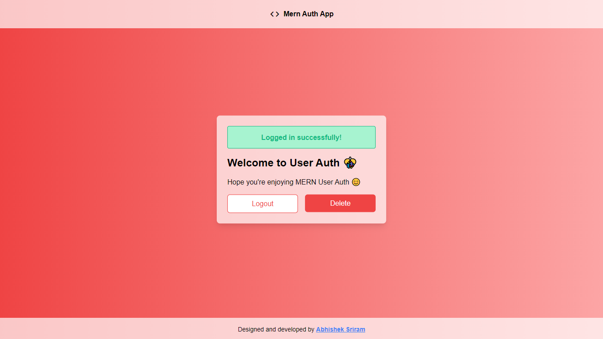

# User MERN Auth

- User authentication implemented using **MERN stack**

## Technologies used

- Frontend :
  1. TailwindCSS for styling the webpage
  2. React JS for building SPA
- Backend :
  1. Node.js
  2. Express.js
  3. MongoDB
  4. Others:
     - JSON Web Tokens for user authentication
     - Bcrypt for hashing password

## Templates

1. Home screen :
    
   
    
2. Sign-Up page :
    
   
    
3. Sign-In page :
    
   
    
4. Forgot Password :
    
   
    
5. Internal Errors which occur durin user authentication :
   1. User doesn't exist -
       
      
       
   2. Entered info incorrectly -
       
      
       
6. Dashboard :
    
   
    
